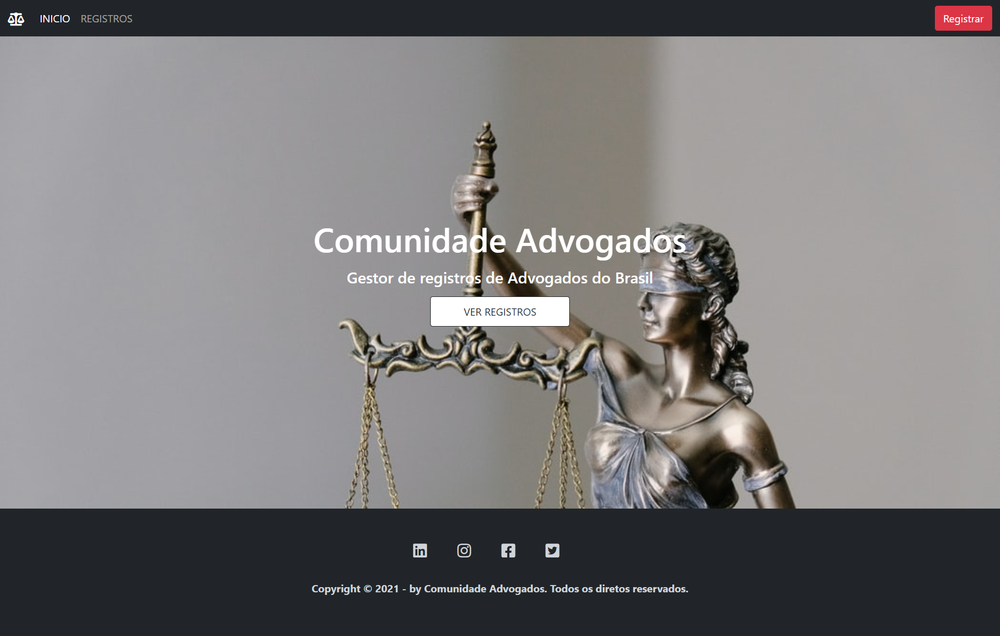
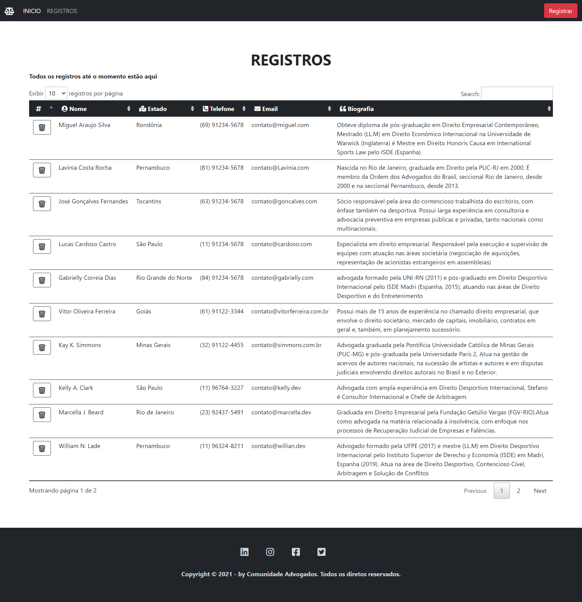
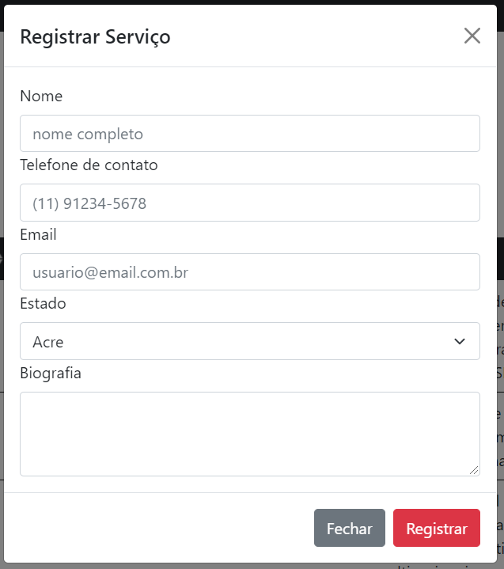

# com-adv ⚖️

 

 
Node.js application for lawyer registration.

### 🔧 Installation

To clone the project via HTTPS, run this command:

    git clone https://github.com/EuCarlos/com-adv.git

After the clone is finished, install the dependencies with the command:

    npm install  

With the installations of the dependencies completed, we can start the execution of the project.

### 👷🏽 Execution and other setup

To start the application, run the command:

    node index.js

### 👨🏽‍💻 Demonstration of use
To see the project in production [CLICK HERE](https://youtu.be/gUcVtKsJ1FM) to see the video on youtube.

### 📸 Project Images

<table style="width:100%">
  <tr>
    <td></td>
  </tr>
   <tr>
    <td></td>
  </tr>
    <tr>
    <td align="center"></td>
  </tr>
    <tr>
    <td></td>
  </tr>
  <tr>
    <td></td>
  </tr>
</table>

### ⛏ Resources
- [Bootstrap](https://getbootstrap.com/): the application design was created almost entirely using this framework.
- [FontAwesome](): vector icons in general were used from Font Awesome.
- [DataTable](https://www.datatables.net/): JQuery plugin that adds interactive controls to HTML tables.

### 📜 License
This project is licensed under the GNU General Public License v3.0. Read the [LICENSE](https://github.com/EuCarlos/com-adv/blob/main/LICENSE) file for more information.

Created with 💜 by [Carlos Alves](https://github.com/eucarlos/)
